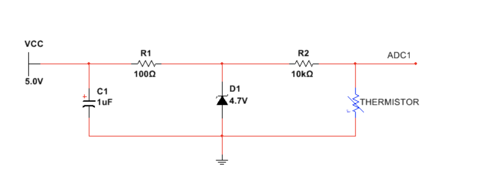
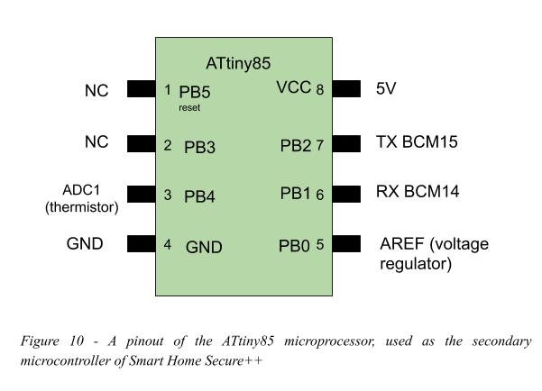
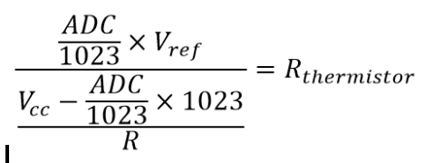
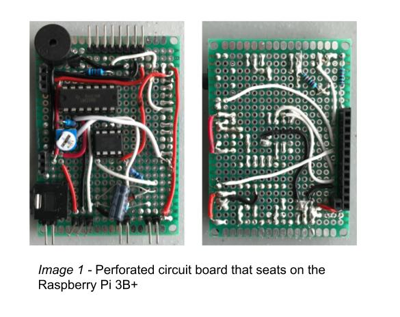

<h1>Smart Home Secure++</h1>

<h3>Milestone: Final Design Review

Noah Rivas, Christian Arévalo, David Bone, Abeden El Kintaoui
</h3>
ECE 387

Spring 2019

May 6, 2019

<h3>Introduction and Project Objectives</h3>

Our homes are more than just four walls and a roof, it\'s a place to
feel safe and share memories with those we love. Accidents occur every
day in our world, from fires to robberies. Ensuring that you are
protected is a necessity in this day and age. Smart devices are found
nearly everywhere, having a smart home that can provide security to your
home is essential. Many homes are already equipped with systems to
ensure peace-of-mind and improve our quality of life. Most smart home
devices require expensive add-ons and can be a hassle to set up, all
without providing the basic needs of the user. It\'s time to introduce
the Smart Home Secure++.

Smart Home Secure++ provides the user with an all-in-one
security-system, temperature management, weather briefings, and control
over appliances. Encapsulating pre-existing systems in your home, this
easy-to-use wall-mounted unit will give you control of your home
environment, making it safe, comfortable and enjoyable. A typical smart
security-system can have high installation cost, and a monthly fee to
use. Our Smart Home Secure++ can provide the same capabilities as a
normal security-system and other features at a fraction of the cost.
Smart Home Secure++ is also expandable. This allows you to adapt the
system after installation to add more security and entertainment to your
home. Its simple extensibility also allows you to connect more
appliances or sensors to your smart home easily, making your home as
customizable as you'd like.

<h3>Methods/Technical Approach</h3>

*Specifications:* The high-level specifications for the Smart Home
Secure++ are:

-   Smart Home Secure+ will remain online 24/7, consistently checking indoor temperature, updating local weather, and                                       monitoring door usage.

-   The touchscreen LCD will be used to navigate simple menus to view the state of the home.

-   Settings can be adjusted at will based on the user\'s preferences, such as font and font size, color scheme, local weather update frequency, indoor temperature update frequency, security passwords.

-   The device will require a network connection, providing the user with a means of automatically checking for and updating the local weather.

The Smart Home Secure++ satisfies the four project requirements by using
digital and analog components, an interface with a microcomputer, and
data collection with signal processing. Each element is vital in their
own way and is explained as follows:

<h4>Digital Design:</h4>
The secondary microcontroller provides access to multiple ADCs and a
serial interface. The secondary microcontroller is essential for
providing the unit with extensibility for additional sensors to be
equipped as needed. The primary microcontroller will periodically
request temperature data from the temperature sensor through the serial
communication between the two microcontrollers. The system's state will
be dependent on data from the sensors and user inputs. External
appliances will be switched independently using the general purpose
input/output (GPIO) pins configured as outputs of the main
microcontroller through an array of electromechanical relays. Additional
GPIO pins will be configured as digital inputs to sense if doors are
open or closed using a simple reed switch. Finally, one additional GPIO
pin will be used to generate an audio tone to a buzzer for auditory
feedback. Tones will be generated for certain system states or events
such as: arm, disarm, security breach alarm, and smoke detected alarm.
The device will provide a graphical user interface (GUI) with navigable
menus via the touch screen.

<h4>Analog Design:</h4>
The Smart Home Secure++ relies on analog devices for sensing the state
of your home. Two sensors were implemented: thermistor for temperature
sensing, and a smoke detector. A low-noise voltage regulator will be
used to generate a reference voltage which will be used in conjunction
with a thermistor voltage divider circuit and an internal analog to
digital converter (ADC) to determine the thermistor voltage drop. The
10-bit ADC on the secondary microcontroller will read a 0 to Vref DC
signal. Likewise, a smoke detector module outputs a 0-5 Volts signal
that corresponds to the amount of smoke around the device which will be
compared to a predetermined threshold voltage with a comparator.

<h4>Interface with a Microcomputer:</h4>
A primary microcontroller will drive the unit. A liquid crystal display
(LCD) touchscreen will be connected via the GPIO pins for the
touchscreen array and a high definition multimedia interface (HDMI)
connection for the video signal. The primary microcontroller will
generate a graphical user interface (GUI) to be displayed on the LCD
screen. Home appliances (i.e. lights, televisions, speakers, etc.) will
be controlled using an array on electromechanical relays which are
controlled by setting the values of GPIO output pins of the primary
microcontroller. A secondary microcontroller with built-in 10-bit ADCs
will be connected via serial communication with the primary
microcontroller. The secondary microcontroller will read in signals from
the temperature sensor and provide data to the main microcontroller. The
smoke threshold comparator will send a 1-bit signal on the primary
microcontroller's GPIO. A piezo buzzer will be connected to an output
GPIO pin on the primary microcontroller to provide auditory feedback. An
input pin will be configured on the primary microcontroller to sense a
doors state (open or closed).

<h4>Data Collection and Signal Processing:</h4>
The analog output signals from the temperature sensor will be read and
processed in an ADC on a secondary microcontroller. The resulting
digital data will be sent via serial communication and collected on a
primary microcontroller for computing and executing responses to
received inputs. The unit will also gather weather data from the web
through an application programming interface (API), parse the data
received and display it for the user. Auditory feedback is delivered via
piezo buzzer; beep tones are generated depending on changes of the
system's state, such as: security breaches, smoke detection alerts, door
alerts. Additionally, the analog smoke sensor voltage will be compared
against a threshold voltage with a comparator to determine if smoke is
present.

<h3>Detailed Design</h3>

The sections below provide flow charts, circuit diagrams, and GUI
layouts for the Smart Home Secure++.

*Figure 1 - Block diagram of the Smart Home Secure++*

Figure 1 shows a general overview of the project. The diagram is divided
into the following subsections: analog components, digital components,
µCPU interface, and data collection with signal processing. Each
subsection is outlined in the sections below.

<h4>Digital Design</h4>

A serial connection will be made between the primary microcomputer and
the secondary microcontroller. As shown in figure 2, the Raspberry Pi
will poll the ATtiny, which is equipped with internal analog to digital
converters, to get the ADC reading, then convert it to a temperature in
Fahrenheit degrees. After conversion it will send the value as a string
to the primary microcomputer, which will log the temperature and display
the value. 

The smoke sensor produces a dc voltage ranging from 0-5 Volts. The smoke
sensor voltage is compared with a pre-determined smoke threshold voltage
of 0.5 Volts. If the smoke sensor voltage exceeds the threshold, a smoke
detect bit will be set. The smoke detect bit will be read using an
interrupt service routine on the primary microcontroller and change the
system state accordingly. Figure 3 shows a flow chart of the smoke
sensor circuit.

The primary microcomputer will handle menu navigation based on touch
input from the user. In figure 4, the graphical user interface (GUI) is
shown. Each menu item displays data to the user or acquires data from
the user. 

The output devices will be controlled via binary signals. The buzzer
will receive a square wave with a certain tone pertaining to each state:
security arm, security disarm, security breach alarm, or smoke detection
alarm. The buzzer circuit will be consisted of a npn transistor with the
buzzer in parallel with a resistor at the source as seen in figure 5.
According to the buzzer's datasheet, the buzzer may be modelled as a
capacitor. The resistor in parallel with the buzzer is essential for
charging and discharging the piezo buzzer.

The two electromechanical relays, shown in figure 6, will be controlled
via 1-bit signals from the primary microcomputer. The relays have
internal transistor circuits for driving the coils. These transistors
effectively reduce the current draw from the GPIO. The data sheet for
the relay breakout boards report a maximum current draw of 1.9 mA at the
input. The relays can switch lights, stereos, and any other appliances
in the home. For demonstration a 5V Vload will be applied to an LED
circuit and a dc fan.

A binary signal will come from the door sensors indicating door
open/closed status to the primary microcomputer as shown in figure 6. A
pull-down resistor is used to bring the signal to ground when the reed
switch is open. When a magnetic field is introduced to the reed switch,
the switch closes and the signal goes high.

*Figure 6 - Circuit diagram of an array of relays, and a reed switch*

The smoke detection sensor will be implemented by using the LM339
comparator, comparing the voltage coming out of the smoke sensor to a
preset threshold voltage of 0.5 Volts. This threshold voltage can be
changed easily using a potentiometer in a voltage divider circuit as
seen in figure 7. The smoke sensor will output a range of voltages. The
output of the smoke sensor will go into a comparator with the reference
voltage and depending on output of the smoke sensor. The comparator will
send a signal that the microcontroller can then read to acknowledge that
there is smoke present. The smoke sensor works by using a

voltage divider with both a chemiresistor and a resistor. The
chemiresistor will change its resistance depending on the concentration
of gas in in the air around it. This will in turn change the voltage
between the resistor and chemiresistor. This voltage is then sent as the
output voltage of the smoke sensor.

The temperature sensor is connected to an ADC on the secondary
microcontroller. As shown in figure 8, the temperature sensor will be
implemented using a thermistor in a voltage divider circuit for the ADC
to reference and a zener regulator with a capacitor to minimize any
noise from our Vcc. The thermistor will change the voltage across itself
depending on its temperature. This voltage is then sent to an ADC to be
analyzed as explained later in signal
processing.

*Figure 8 - Circuit diagram consisting of a thermistor and voltage regulator.*

<h4>Interface to Microcontroller</h4>
 

In figure 9 the schematic for the primary microcomputer, Raspberry Pi
3B+ is shown as well as its pin assignments and connections the door
sensors (reed switch), buzzer, relays, LCD display, and a serial
connection. The GPIO pins interface with the Raspberry Pi through the
the BCM2835 chipset. The BCM2835 provides peripheral functions to the
ARM processor on the Pi, such as an interrupt controller, PWM, USB,
timers, UART (serial), and other peripherals not used in this project .

In figure 10, the secondary microcontroller, ATtiny85 is shown with its
pin assignments, connections to the temperature sensor, voltage
regulator, and the serial connection. The ATTiny uses PortB (PB0-PB5) to
configure and controls its bidirectional pins as outputs or inputs.

<h4>Data Collection and Signal Processing</h4>

When the secondary microcontroller is invoked by the primary via the
polling scheme (see figure 2), the value will be read via the 10-bit ADC
register. The 10-bit value will be converted into a voltage using the
voltage divider principle. Then, the resistance value of the thermistor
will be determined with the following formula:

Where V~ref~ is the analog reference voltage, ADC is a 10-bit register
value, and R is the resistance value of the second resistor (see R2 in
figure 8).

Next, temperature is found using the simplified Steinhart--Hart equation
for thermistors.

Where, T is the measured temperature, T~0~ is the nominal temperature
for the thermistor, B is the beta value for the thermistor,
R~thermistor~ is the calculated value for the thermistors resistance,
and R~0~ is the nominal resistance of the thermistor.

Once the temperature is calculated, the value will be converted into a
string, and then sent via serial, as shown in figure 11, at a baud rate
of 9600 bps. The primary microcomputer will log the temperature with a
timestamp, and update the graph for displaying to user.

Meanwhile, the smoke sensor will be continuously outputting a voltage to
the comparator, if the value exceeds the threshold, a high signal (3.3V)
will be sent to the microcomputer. The primary microcomputer will read
the signal using an interrupt service routine. When smoke is detected,
the main program is interrupted, and the alarm will sound. See the
flowchart in figure 12.

The buzzer will sound under the following conditions as shown in figure
12 and 13. When the security system arms, a two-tone beep will sound.
Conversely, when the device is disarmed, a complimentary two-tone beep
will sound. If the security system is armed and the door opens, the
buzzer will beep periodically until the correct passcode is entered
(disarmed). If the device is armed, the door opens, and the passcode is
not entered correctly or within a certain time constraint, the security
alarm will sound. Lastly, the smoke alarm will sound if the smoke detect
bit is set high. 

A WiFi network connection will be configured using the Raspberry Pi's
network adapter. A weather data API will be invoked periodically with a
local zip code. The API will respond with a text file containing local
weather data. The data is parsed, and only the daily HI/LO temperature,
current temperature, and current weather conditions will be displayed to
the user. Figure 13 shows a detailed flowchart of the Web API.

<h3>Results and Discussion</h3>

Results are shown for each of the following sections: analog, digital,
interface to microcontroller, and signal
processing.

<h4>Analog Results</h4>

Simulations were performed to predict the response due to known inputs.
Smoke sensor was known to output a voltage above 0.5 volts when smoke
was applied to the sensor. A comparator circuit was designed with a
voltage divider to tune the threshold voltage. The simulation shown in
figure 14 shows the smoke sensor simulated as a frequency generator
configured as a ramp wave with 2.0 Vpp at 1 Hz. The output is shown
using a simulated oscilloscope. It was found that when the smoke sensor
exceeds the threshold, the output voltage goes high (3.3 Volts).

Another simulation was performed to examine the response of the zener
voltage regulator during different load conditions as temperature
changes. The largest load would be when the thermistor goes to zero,
which would not occur. Even under this extreme, the zener maintains a
steady reference voltage. In addition to voltage stability, the
simulation also provides power dissipation of the zener as shown in
figure 15. {width="4.919992344706912in"
height="3.088542213473316in"}

<h4>Digital Results</h4>

The buzzer circuit that was drawn in figure 5 shows how the buzzer acts
as a capacitor. This means that the buzzer will have some value for its
capacitance as well as a time constant because of the resistor in
parallel with it. However, the capacitance of the buzzer is so small
that we were able to exceed a 20kHz frequency which is beyond the
audible range of frequencies for the average person. Because the
capacitance is so low and the resistance is also relatively low, the
time constant which determines the time needed to charge and discharge
is also going to be extremely low, allowing for much higher frequencies
that the primary microcontroller cannot
supply.

The reed switch will interact with the magnet on the door and creates a
short connecting to the microcontroller as well as a pulldown resistor.
The pulldown resistor ensures that the microcontroller reads 0 Volts
when the reed switch is opened or when the door is opened and when the
door closes, the reed switch will allow for 5 Volts to pass through it
which can be picked up on the primary microcontroller

In screenshot 1, we can see an Oscilloscope view of the buzzer circuit.
Although we were only at 1kHz when the screenshot was taken, we were
able to prove that the buzzer was capable of exceeding 20kHz. When we
pushed the buzzer beyond 20kHz, the Oscilloscope would only show a
vertical line with no curvature of the buzzer charging or discharging.
This shows just how small the capacitance must be and how much noise is
present.

The current limiting resistor for the buzzer has a value of 1kჲ and will
draw no more than 3.3mA at 3.3V. Which means that the maximum power
dissipation across resistor will not exceed 10.8mW. The buzzer is
modeled as a capacitor so using the circuit we drew, we can calculate
the maximum amount of power dissipated from it. The maximum voltage
across the buzzer is 5V and the maximum instantaneous current through
the capacitor is 30mA which was taken from its datasheet. This means the
maximum power dissipated would be 150mW. This leaves the power
dissipated from the resistor in parallel with the buzzer. The maximum
voltage across the resistor is 5V and the maximum current is 5mA.
Therefore the power dissipated would be 25mW. The total power
consumption of the entire buzzer circuit will be a safe 175mW.

<h4>Interface to Microcontroller Results</h4>

To interface the Raspberry Pi, a perforated bare circuit board was
soldered with the appropriate connections to form a "hat" for the
Raspberry Pi, as shown in image 1. On this circuit, the ATtiny is also
interfaced with its appropriate connections.

Raspberry Pi 3B+ documentation suggests the max current drawn
simultaneously from all the GPIO should be under 50 mA for safe
operation, and up to 16 mA maximum per GPIO. Each GPIO is operated at
3.3 Volts. The input signals can sink up to 16 mA. However in this
design, external pull-up and pull-down resistors are used to sink the
current outside the Raspberry Pi to ensure safe operation.

The 5V rail of the Raspberry Pi is directly connected to the input 5V
power supply. The power supply used in this design is rated for 2.0 Amps
at 5 Volts. Raspberry Pi documentation indicates that the bare machine
consumes about 500 mA.

The following table shows a summary of the rated and designed currents
in our design

*Table 1 -* Rated and designed current specifications for pins used in
the Smart Home Secure++ system on the Raspberry Pi 3B+.

<h4>Signal Processing Results</h4>

The web API used to collect weather data was the OpenWeatherMap weather
API. The API allows you to request weather data from a specific zip
code. The API responds with information about the location and the basic
forecast for that zip code. The data is read in and desired values are
parsed, such as, daily high, daily, low, current temperature, and
current conditions. However, it was found that the API does not always
give reliable results. For certain zip codes, such as those of Honolulu,
Hawaii, the reported high temperature would be much lower than those
values reported by trustworthy weather reporters such as Accuweather.
For future revisions, more weather data web APIs should be explored.

Temperature in the home was found using a thermistor in a voltage
divider circuit, refer to figure 8. The second resistor's resistance was
measured and the voltage applied to the divider circuit is known due to
the zener voltage regulator circuit. With these values available, the
voltage is measured using the ADC on the ATtiny. The temperature is the
determined by using the formula outlined in data collection and signal
processing section above. This value is then sent to the Raspberry Pi
where it is time stamped and stored to the SD card in a ".csv" file. The
".csv" is then used to draw a graph of temperature versus time. The file
is updated in real time allowing the graph to update as more temperature
data points are added, refer to screenshot 2.

In addition to storing temperature data, user preferences and setting
are saved in a ".json" file on the SD card. Preferences such as:
security passcode, zip code, button debounce, pin assignments, and font.
This allows settings to be saved after the GUI program has been
restarted. Certain settings, such as font, zip code, and pass code, can
be adjusted in the GUI by the user. Other settings must be adjusted in
the ".json" file directly.

<h3>Lessons Learned</h3>

-   **Planning:** Although, we had a good plan to stay on track and meet deadlines, we did have some unforeseen delays. Our Zener diodes were ordered through Digikey through the colleges accounts. For a while, the order was made and even sent to campus, but was not delivered to us. Fortunately, our design did not depend on the zener, and we were able to continue with no issues.

-   **Team work:** We have learned to combine our knowledge and overcome the learning curve to bring the project to fruition. Dividing tasks into our individual skill sets was a necessity. As a team, we had two set meeting times outside of class period each week. At these meetings we discussed what needed to be done that week and how we would accomplish our goals.

Overall, each member worked very hard throughout this semester, and we are all very pleased with the project we created.
